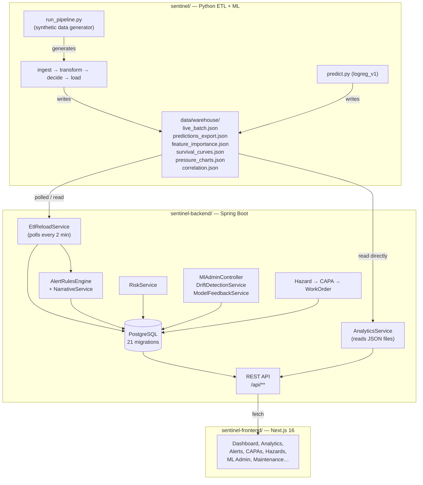

# 02 — Sentinel V4 Architecture Review

> Deep technical review of the current architecture. Every problem section follows the format:
> **Problem → Impact → Root Cause → Recommended Solution → V4 Target**

---

## 1. Current Architecture Diagram



---

## 2. Architecture Problem Inventory

### 2.1 File-Based ETL Handoff

**Problem:** The Python pipeline writes `live_batch.json` and `predictions_export.json` to a local filesystem directory. Spring Boot polls this directory every 2 minutes and reads the files. `AnalyticsService` reads four additional warehouse JSON files directly.

**Impact:**
- Race condition: Spring Boot may read `live_batch.json` while Python is mid-write, producing a corrupt or partial parse.
- 2-minute minimum latency on all data updates, regardless of urgency.
- Works only when both processes share a filesystem (breaks in production where `ETL_ENABLED=false` and no warehouse exists).
- `AnalyticsService` returns HTTP 500 in production — not a graceful degradation.
- No atomicity: if the pipeline crashes mid-write, the last file state is indeterminate.
- Impossible to scale horizontally (two backend instances would race to process the same file).

**Root Cause:** Design decision to avoid a message broker or direct DB write from Python. The handoff was sized for a hackathon demo where Python and Java ran on the same laptop.

**Recommended Solution (V4):**
- Python writes directly to PostgreSQL using `psycopg2` (incidents, audits, predictions, telemetry).
- Eliminate `live_batch.json`, `predictions_export.json` entirely.
- Analytics JSON files replaced by DB-computed analytics endpoints in Spring Boot.
- Spring Boot's `EtlReloadService` moves from "poll a file" to "process DB rows since last batch_id."

**V4 Target:**
```
Python write → PostgreSQL (direct, atomic, transactional)
Spring Boot read ← PostgreSQL (always consistent, no race)
```

---

### 2.2 AnalyticsService is a File Proxy

**Problem:** All four analytics endpoints (`/survival-curves`, `/pressure-charts`, `/correlation`, `/feature-importance`) read pre-computed JSON files from `data/warehouse/`. They return `ResponseEntity<String>` with the raw file content.

**Impact:**
- Returns HTTP 500 in production (no warehouse on Render).
- Data is stale — it reflects the last time Python ran locally, not the current DB state.
- No filtering or parameterisation — cannot filter by site, date range, or model version.
- Tightly couples the Java service to a filesystem path that does not exist in production.

**Root Cause:** Analytics computation was done in Python (survival curves via `lifelines`, correlation via `scipy`). The Java layer was added after the fact as a thin proxy without reimplementing the computation.

**Recommended Solution (V4):**
- Move analytics computation to Java using DB queries.
- Survival curves: approximate from incident history using DB aggregates (no `lifelines` dependency needed for the simple survival fraction calculation).
- Pressure control charts: query `fact_environmental` with rolling window aggregates.
- Correlation: compute from `fact_site_features` view or inline SQL.
- Feature importance: read from `model_registry.feature_importance` (already stored in V21 migration).

**V4 Target:** All analytics endpoints query PostgreSQL. No file dependency. Work identically in development and production.

---

### 2.3 No `src/retrain.py` — ML Loop is Incomplete

**Problem:** The HITL platform has a complete frontend (feedback queue, registry, promote/reject), a complete DB schema (`model_feedback`, `model_registry`, `training_run`, `retraining_schedule`), and a drift detection service — but `src/retrain.py` does not exist. The feedback-to-retrain-to-challenger loop is broken at the most critical step.

**Impact:**
- `model_feedback` table accumulates rows that are never consumed.
- "Trigger Retrain" button in the frontend fires a request that currently has no Python-side action.
- The champion model (`logreg_v1`) is permanently frozen.
- Drift detection flags degradation but there is no mechanism to act on it.

**Root Cause:** ML retraining was scoped into the HITL plan but not yet implemented. The DB schema and API wiring were built ahead of the Python execution layer.

**Recommended Solution (V4):**
- Implement `src/retrain.py` that: fetches `model_feedback` from PostgreSQL via the API (or direct DB connection), combines with `fact_site_features`, retrains the same logistic regression pipeline, evaluates on a holdout set, saves a challenger `.pkl`, and registers it via `POST /api/ml/training-run`.
- Add `POST /api/ml/training-run` backend endpoint (currently missing from `MlAdminController`).
- Add `POST /api/ml/trigger-retrain` endpoint that Spring Boot uses to invoke Python retraining (either subprocess call or a Celery-style task).

**V4 Target:** Complete ML lifecycle: feedback accumulates → retrain triggered (manual or schedule) → challenger registered → human approves → champion updated → predict.py uses new champion on next cycle.

---

### 2.4 Duplicate Flyway Migration Versions

**Problem:** The `db/migration/` directory contains two files each for V14 and V15:
- `V14__add_telemetry_pressure_index.sql`
- `V14__hse_foundation.sql`
- `V15__fact_predictions.sql`
- `V15__hse_technician.sql`

This works currently because `out-of-order: true` and `validate-on-migrate: false` are set. However, Flyway considers version as the canonical key — if validation is ever re-enabled, the migration chain breaks. A new developer or CI environment that applies stricter Flyway settings will fail on first run.

**Impact:**
- Production risk: any change to Flyway config (e.g. a library upgrade that defaults to strict mode) breaks migration.
- Developer onboarding confusion: `V14__hse_foundation.sql` and `V14__add_telemetry_pressure_index.sql` are indistinguishable by version.
- Makes DB auditing unreliable — the Flyway history table has two rows with version `14`.

**Root Cause:** Two separate features were added simultaneously and assigned the same version number. The `out-of-order` flag was used as a workaround.

**Recommended Solution (V4):**
- Renumber to: `V14__add_telemetry_pressure_index.sql` → `V14.1__...`, `V14__hse_foundation.sql` → `V14.2__...` (Flyway supports dot-delimited sub-versions).
- Same for V15: `V15.1__hse_technician.sql`, `V15.2__fact_predictions.sql`.
- Re-enable `validate-on-migrate: true` in `application-render.yml` once cleaned.
- This is a **P0** fix applied before any new migrations are added.

**V4 Target:** Clean, sequential, validated Flyway history. `validate-on-migrate: true` everywhere.

---

### 2.5 JWT Secret Management

**Problem:** The JWT signing secret is hardcoded in two committed files:
- `sentinel-backend/src/main/resources/application.yml` (default H2 profile)
- `sentinel-backend/render.yaml` (production Render deployment)

The same secret value (`Gric/GyqJGMk3dwMleaADNDcBGQ3qfOYUmPSDnXSy6lDIfYAG7cY06WPJNJp+Yor`) appears in both files.

**Impact:**
- Any person with repository access can forge valid JWTs for any user.
- Violates the most basic secret hygiene principle — secrets must not be committed to version control.
- Render deployment uses the same weak secret as local dev.

**Root Cause:** Secret was placed in config for development convenience and not rotated before committing.

**Recommended Solution (V4):**
- Remove from both files immediately.
- Replace with `${JWT_SECRET}` environment variable reference only.
- Add `JWT_SECRET` to `.gitignore`-protected `.env.local` for development.
- Rotate the Render environment variable to a newly generated 64-byte random secret.
- Add a CI check that fails if any hardcoded JWT-looking string appears in committed config files.

**V4 Target:** No secrets in version control. All credentials injected at runtime from environment variables.

---

### 2.6 No Backend Tests

**Problem:** `sentinel-backend` has zero meaningful test classes. `mvnw verify` passes because Spring Boot's test auto-configuration runs against H2 with `create-drop` — it verifies the application context starts, nothing more.

**Impact:**
- No regression protection for: alert rule logic, risk score computation, ML feedback logic, CAPA state machine, promotion workflow.
- CI passes even if business logic is broken.
- Refactoring any service is entirely unguarded.

**Root Cause:** Tests were deferred during rapid hackathon development.

**Recommended Solution (V4):**
- Add unit tests for: `AlertRulesEngine` (3 rules), `RiskService` (score calculation), `ModelFeedbackService` (feedback routing), `DriftDetectionService` (accuracy computation), `CapaService` (state transitions).
- Add integration tests for: key API endpoints using `@SpringBootTest` + `MockMvc` with a test PostgreSQL container (Testcontainers).
- Minimum coverage gate: 60% line coverage on `com.sentinel.*` services.

**V4 Target:** Backend CI fails if any service test fails or coverage drops below threshold.

---

### 2.7 Authorization Not Enforced on API Endpoints

**Problem:** The ML Admin Portal layout checks the JWT role client-side in TypeScript (`decodeRoleFromJwt()`). However, backend API endpoints are not consistently annotated with role requirements. An `HSE_OFFICER` user can call `PATCH /api/ml/model-registry/{id}/promote` directly.

**Impact:**
- Security boundary between roles is enforced only in the UI, not the API.
- Any authenticated user can promote a model, acknowledge alerts, or create users.

**Root Cause:** `@PreAuthorize` or role-check annotations were not added during feature development.

**Recommended Solution (V4):**
- Add `@PreAuthorize("hasRole('ML_ADMIN')")` on promotion, rejection, rollback endpoints.
- Add `@PreAuthorize("hasAnyRole('ADMIN', 'HSE_OFFICER')")` on alert acknowledgement, hazard creation, CAPA state changes.
- Add `@PreAuthorize("hasRole('ADMIN')")` on user creation and role management.
- Write integration tests that verify 403 is returned for insufficient roles.

**V4 Target:** All write endpoints explicitly declare their required role. A 403 integration test exists for each.

---

### 2.8 EtlReloadService Process Management

**Problem:** `EtlReloadService.startEtlLoop()` launches `run_live.sh` as a `ProcessBuilder` subprocess from within the Spring Boot JVM. The subprocess is managed by a `Process` field on the service bean.

**Impact:**
- If the Spring Boot application crashes and restarts (Render restart), the old `run_live.sh` process may be orphaned and keep running.
- On Render's free tier, the container is killed and recreated — but the Render container doesn't know to kill child processes first, so `INTERVAL` may overlap.
- The `@PreDestroy` `stopEtlLoop()` is only called on graceful shutdown, not on force-kill.
- Multiple Spring Boot restarts → multiple `run_live.sh` processes → multiple concurrent writes to `live_batch.json`.

**Root Cause:** Managing long-running subprocesses within a JVM bean is inherently fragile. This approach was chosen to avoid a separate process manager.

**Recommended Solution (V4):**
- After the Python-direct-DB integration (fix 2.1), `run_pipeline.py` no longer writes to files and no longer needs to be managed as a subprocess.
- The ETL loop becomes a scheduled Python job managed by a process supervisor (cron, GitHub Actions cron, or a simple `supervisor` config on the deployment host).
- `EtlReloadService` becomes a lightweight DB query service, not a subprocess manager.

**V4 Target:** Python ETL runs as a scheduled job independent of the JVM lifecycle. Spring Boot does not spawn subprocesses.

---

### 2.9 Frontend Token Handling

**Problem:** Six client-side frontend pages extract the JWT from the cookie using a regex pattern:
```typescript
const getToken = () => document.cookie.match(/sentinel-token=([^;]+)/)?.[1];
```

**Impact:**
- Fragile: breaks if the cookie name changes, if the cookie has URL-encoding, or if there are cookies with similar names.
- Security: using `document.cookie` means the token is accessible to any JavaScript on the page (not `httpOnly`). XSS vulnerabilities can steal the token.
- Inconsistency: server components use `getAuthToken()` from `@/server/server-actions` — a proper Next.js server action. Client components bypass this.

**Root Cause:** Client components cannot call server actions directly. The cookie regex was a quick workaround for making authenticated requests from client-side `useEffect` hooks.

**Recommended Solution (V4):**
- Use Next.js Route Handlers (`/api/*`) as a BFF (Backend-for-Frontend) layer for client-side authenticated requests. The route handler reads the httpOnly cookie server-side and proxies to the Spring Boot API.
- Or: set the JWT as an httpOnly cookie and use a `/api/auth/token` route handler that returns the token only to verified same-origin requests.
- Eliminate all `document.cookie.match(...)` patterns across the codebase.

**V4 Target:** Zero occurrences of `document.cookie` in application code. All token handling goes through Next.js server infrastructure.

---

### 2.10 No Data Fetching Strategy / Stale Data

**Problem:** All server components use `cache: "no-store"` on every fetch. Client components call `fetch` inside `useEffect` with no retry, no loading state standardisation, and no polling.

**Impact:**
- Every page navigation triggers full re-fetching of all data, regardless of how recently it was loaded.
- No real-time updates: the dashboard data is only as fresh as the last page load.
- No consistent loading/error UX pattern across pages.

**Root Cause:** No data fetching library was adopted. React Query was not added.

**Recommended Solution (V4):**
- Add TanStack Query (React Query) for client components that need polling or cache.
- For the main dashboard: set a 2-minute `staleTime` to match the ETL cycle.
- For the alerts feed: use `refetchInterval: 30_000` to show near-real-time alerts.
- Server components keep `cache: "no-store"` for initial render freshness.

**V4 Target:** Consistent data freshness policy. Alert feed refreshes every 30s without page reload. Dashboard data cached for 2 minutes client-side.

---

### 2.11 `loadPredictions()` O(n) Database Lookups

**Problem:** In `EtlReloadService.loadPredictions()`, for each prediction record in `predictions_export.json`, the code calls `predictionRepository.findLatestBySiteId(siteId)` — one DB round-trip per site.

```java
boolean exists = predictionRepository.findLatestBySiteId(siteId)
    .map(p -> p.getAsOfDate().equals(asOfDate))
    .orElse(false);
if (exists) continue;
```

**Impact:**
- For 6 sites × daily predictions = 6 individual DB queries per ETL cycle.
- As the site count grows (e.g. loading historical predictions), this becomes a bottleneck.
- Inconsistent with how incidents and audits are loaded (both use a single `findExistingIds()` bulk query).

**Root Cause:** The prediction loader was written after the incident/audit loaders and didn't follow the same pattern.

**Recommended Solution (V4):**
- Add `findExistingByAsOfDates(Set<String> siteIds, Set<LocalDate> dates)` query to `PredictionRepository`.
- Bulk-check before the loop, same as `loadIncidents` and `loadAudits`.

**V4 Target:** `loadPredictions()` uses at most 1 DB query to determine what already exists.

---

### 2.12 `EtlPushController` API Key Placeholder

**Problem:** `render.yaml` sets the `ETL_API_KEY` environment variable to the string `REPLACE_WITH_STRONG_RANDOM_KEY`. The CI workflow `etl-cron.yml` uses this key to authenticate push requests. If the key is not changed before deployment, push requests from CI will fail (or succeed with an insecure known key).

**Impact:**
- Data pipeline broken in production if key not changed.
- If someone deploys without reading the placeholder warning, the CI push silently fails every 15 minutes.

**Root Cause:** Placeholder was added as a reminder but never enforced.

**Recommended Solution (V4):**
- Generate a real key (`openssl rand -base64 32`) and store in GitHub Secrets + Render environment.
- Add a startup check in `EtlPushController` that logs a loud `ERROR` warning if the API key matches the placeholder string.

---

### 2.13 Missing `POST /api/ml/training-run` Endpoint

**Problem:** `MlAdminController` exposes GET endpoints (`/overview`, `/model-registry`, `/training-runs`) but there is no confirmed `POST /api/ml/training-run` endpoint. The Python retrain script (when built) needs to register completed training runs.

**Impact:**
- The feedback → retrain → challenger loop cannot close without this endpoint.
- `training_run` table can only be populated manually or via direct DB insert.

**Root Cause:** The endpoint was not added because `src/retrain.py` was not built yet.

**Recommended Solution (V4):**
- Add `POST /api/ml/training-run` accepting `{ model_registry_id, triggered_by, rows_used, feedback_rows_used, notes, completed_at }`.
- Add `POST /api/ml/model-registry` accepting new model registration from Python (version, algorithm, precision, recall, f1, artifact_path, feature_importance).

---

## 3. Service Boundary Assessment

### Current Boundaries

| Boundary | Type | Assessment |
|---|---|---|
| Python ETL ↔ Spring Boot | File-based (JSON poll) | Fragile, production-broken |
| Spring Boot ↔ PostgreSQL | JPA / JDBC | Clean, appropriate |
| Spring Boot ↔ Next.js | REST API | Clean, appropriate |
| Spring Boot ↔ Groq LLM | HTTP (optional) | Clean, safe fallback |
| Spring Boot ↔ Python ETL (subprocess) | ProcessBuilder | Fragile, anti-pattern |

### V4 Boundary Targets

| Boundary | V4 Design |
|---|---|
| Python ETL → PostgreSQL | Direct psycopg2 writes (incidents, audits, predictions, telemetry) |
| Python retrain → Spring Boot | HTTP POST to register training run and model |
| Spring Boot → Python retrain | HTTP POST trigger (or direct subprocess call for V4 simplicity) |
| Spring Boot ↔ PostgreSQL | Unchanged — JPA remains appropriate |
| Spring Boot ↔ Next.js | REST API unchanged; add BFF route handlers for client auth |
| Next.js client → Spring Boot | Via Next.js Route Handlers (not direct cookie regex) |

---

## 4. Data Flow Assessment

### Current Data Flow (Production — broken paths marked ✗)

```
run_pipeline.py → live_batch.json ✗ → EtlReloadService → PostgreSQL → API → Frontend
predict.py → predictions_export.json ✗ → EtlReloadService → PostgreSQL → API → Frontend
predict.py → feature_importance.json ✗ → AnalyticsService → API 500 ✗
predict.py → survival_curves.json ✗ → AnalyticsService → API 500 ✗
```

### V4 Data Flow (all paths working in production)

```
run_pipeline.py → PostgreSQL (direct) → API → Frontend
predict.py → PostgreSQL (direct) → API → Frontend
AnalyticsService → PostgreSQL (query) → API → Frontend
retrain.py → PostgreSQL (feedback read) → train → artifact save → API register → champion
```

---

## 5. Summary of Architectural Issues

| Issue | Severity | Category |
|---|---|---|
| File-based ETL handoff | Critical | Integration |
| AnalyticsService file proxy (prod broken) | Critical | Integration |
| No `src/retrain.py` — ML loop broken | Critical | ML Platform |
| Duplicate Flyway versions | High | Database |
| JWT secret in version control | High | Security |
| No backend tests | High | Quality |
| Authorization not enforced server-side | High | Security |
| EtlReloadService subprocess management | High | Reliability |
| Frontend token via `document.cookie` regex | Medium | Security |
| No data fetching strategy / stale data | Medium | Frontend |
| `loadPredictions()` O(n) queries | Medium | Performance |
| ETL_API_KEY placeholder | Medium | Operations |
| Missing `POST /api/ml/training-run` | Medium | ML Platform |
