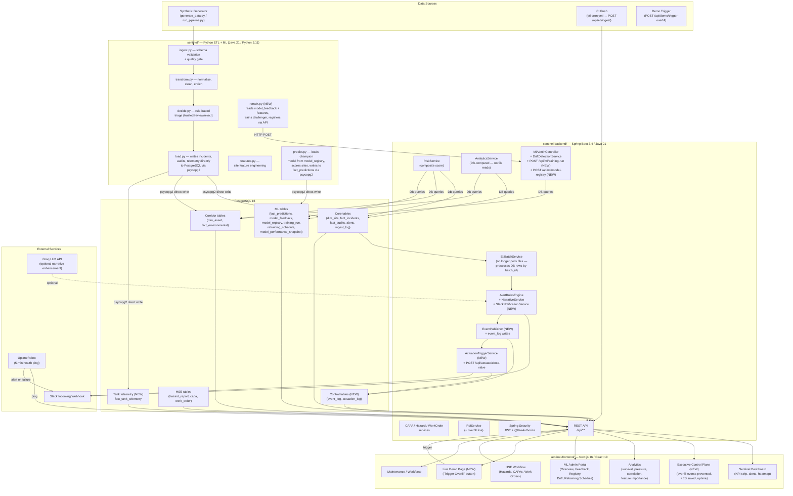
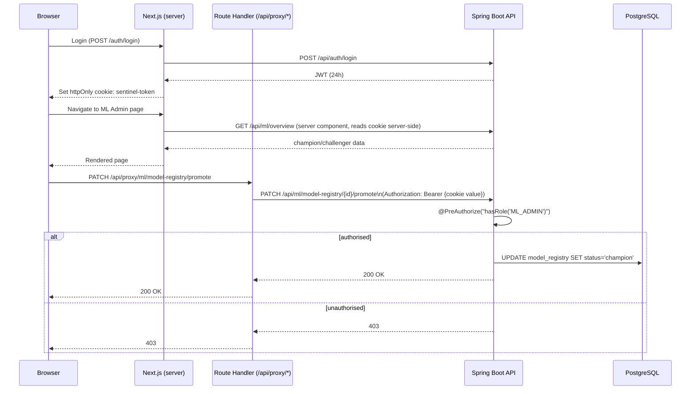
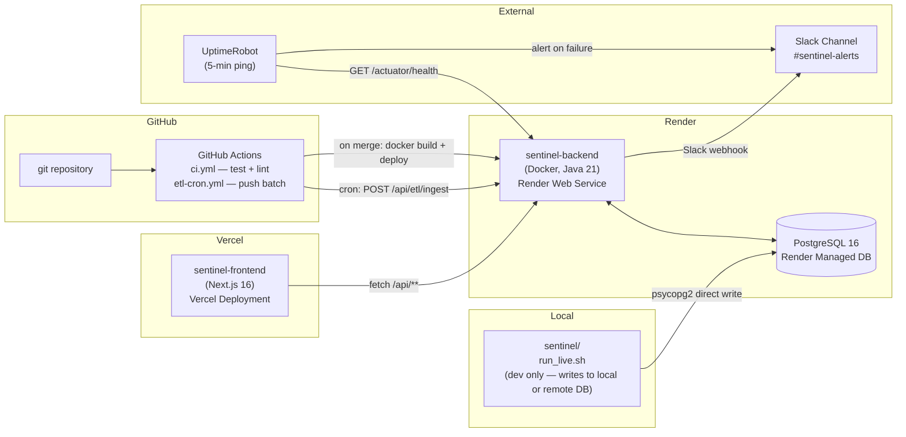

# 05 — Sentinel V4 Target Architecture

---

## 1. System Overview

Sentinel V4 is a three-layer system: a **Python data + ML layer**, a **Java REST API layer**, and a **Next.js presentation layer**. The critical V4 change from V3 is that the Python layer writes **directly to PostgreSQL** instead of through JSON files — eliminating the file-based handoff that is the root cause of most current production failures.



---

## 2. Layer Responsibilities

### 2.1 Python Layer (`sentinel/`)

| Module | V4 Responsibility |
|---|---|
| `generate_data.py` | Synthetic data generation (incidents, audits, telemetry, **tank telemetry**) |
| `ingest.py` | Schema validation, quality gate (trusted / review / reject) |
| `transform.py` | Normalisation, cleaning, enrichment |
| `decide.py` | Rule-based triage |
| `load.py` | **Direct psycopg2 writes** to PostgreSQL (replaces JSON file output) |
| `features.py` | Feature engineering per site (7 features + new tank features) |
| `predict.py` | **Reads champion from `model_registry`**; scores all sites; writes to `fact_predictions` via psycopg2 |
| `retrain.py` *(new)* | Reads `model_feedback` + features from DB; trains challenger; registers via `POST /api/ml/model-registry` + `POST /api/ml/training-run` |
| `run_pipeline.py` | Orchestrates ingest → transform → decide → load → predict in sequence |
| `diagnostics.py` | Survival, pressure, correlation computations (kept for local validation; analytics moved to DB) |

### 2.2 Java Backend (`sentinel-backend/`)

| Module | V4 Responsibility |
|---|---|
| `auth/` | JWT authentication, Spring Security, `@PreAuthorize` role enforcement on all write endpoints |
| `etl/` | `EtlBatchService` — processes new DB rows since last batch_id (no file polling); `EtlPushController` for CI push mode |
| `alert/` | `AlertRulesEngine` (3 rules + overfill rule NEW), `NarrativeService` + `SlackNotificationService` (NEW) |
| `actuation/` *(new)* | `ActuationTriggerService`, `POST /api/actuate/close-valve`, `actuation_log` repository |
| `event/` *(new)* | `EventPublisher`, `event_log` repository |
| `risk/` | `RiskService` — composite score (incidents + audits + pressure + predictions + tank level NEW) |
| `analytics/` | **DB-computed** survival curves, pressure control charts, correlation, feature importance (no file reads) |
| `ml/` | `MlAdminController` — all existing endpoints plus `POST /api/ml/training-run` (NEW) and `POST /api/ml/model-registry` (NEW); `DriftDetectionService`; `ModelComparisonService` |
| `prediction/` | `PredictionService` — reads `fact_predictions` per site |
| `roi/` | `RoiController` + overfill-specific ROI line (NEW) |
| `hse/` | Hazard, CAPA, WorkOrder services (unchanged) |
| `demo/` *(new)* | `POST /api/demo/trigger-overfill` — injects seeded tank telemetry to trigger the full loop for live demo |
| `executive/` *(new)* | `GET /api/executive/summary` — overfill events prevented, KES saved, system uptime |
| `user/` | User CRUD (unchanged) |

### 2.3 Frontend (`sentinel-frontend/`)

| Page | V4 Change |
|---|---|
| Sentinel dashboard | No structural change; alert feed uses `refetchInterval: 30_000` via TanStack Query |
| **Executive Control Plane** *(new)* | 4 large KPI cards: overfill events prevented, estimated litres saved, KES exposure avoided, system uptime |
| Analytics | No structural change; analytics now come from DB-computed endpoints (resilient in prod) |
| ML Admin (all 5 pages) | Client mutations use TanStack Query `useMutation` for consistent optimistic UI |
| **Live Demo page** *(new)* | Single "Simulate tank overfill at Site X" button; real-time event feed showing detect → act → notify → report loop |
| ROI Calculator | Add overfill-specific line to assumptions table |
| Token handling | All client authenticated requests routed through Next.js Route Handlers (no `document.cookie` regex) |

---

## 3. Data Flow — V4

### 3.1 Normal Pipeline Cycle (every N minutes via run_live.sh)

```
run_pipeline.py
    │
    ├─ generate synthetic batch (incidents, audits, tank telemetry)
    ├─ ingest.py → validate → quality gate
    ├─ transform.py → normalise
    ├─ decide.py → trusted/review/reject
    ├─ load.py → INSERT INTO fact_incidents, fact_audits, fact_tank_telemetry
    │             (psycopg2, ON CONFLICT DO NOTHING, atomic per table)
    │
    ├─ features.py → compute 7+N site features
    └─ predict.py → load champion pkl from model_registry.artifact_path
                  → score 6 sites
                  → INSERT INTO fact_predictions (psycopg2, ON CONFLICT DO NOTHING)
```

### 3.2 Spring Boot Alert Evaluation (triggered post-insert via DB notification or scheduled poll)

```
EtlBatchService.processNewRows()
    │
    ├─ query fact_incidents WHERE batch_id > last_batch_id
    ├─ AlertRulesEngine.evaluate(newIncidents)
    │       ├─ Rule 1: high rejection rate
    │       ├─ Rule 2: critical cluster
    │       ├─ Rule 3: critical high-risk site
    │       └─ Rule 4 (NEW): overfill_risk — tank_level_pct > 95 AND valve_status = Open
    │
    ├─ For each High/Critical alert:
    │       ├─ NarrativeService.generate() → templated narrative + optional Groq enhancement
    │       ├─ EventPublisher.publish(event) → INSERT INTO event_log
    │       ├─ ActuationTriggerService.closeValve(site, tank_id) → POST /api/actuate/close-valve
    │       │                                                     → INSERT INTO actuation_log
    │       └─ SlackNotificationService.send(narrative + actuation_ref)
    │
    └─ alerts table updated
```

### 3.3 ML Feedback → Retrain → Champion Cycle

```
Human reviews prediction in ML Admin Feedback Queue
    │
    └─ POST /api/ml/feedback → INSERT INTO model_feedback

CAPA closed by HSE officer
    │
    └─ CapaService.close() → INSERT INTO model_feedback (source='capa_outcome')

[Manual trigger or retraining_schedule reaches next_run_at]
    │
    └─ POST /api/ml/trigger-retrain → Spring Boot invokes retrain.py
                                    (subprocess or GitHub Actions dispatch)

retrain.py
    ├─ GET /api/ml/feedback-export → fetch model_feedback rows
    ├─ query fact_site_features from PostgreSQL
    ├─ train challenger LogisticRegression pipeline
    ├─ evaluate on holdout set (precision, recall, F1)
    ├─ save logreg_v{N+1}.pkl to models/ directory
    ├─ POST /api/ml/model-registry → register challenger
    └─ POST /api/ml/training-run  → register training run

Human reviews challenger in ML Admin Registry page
    │
    └─ PATCH /api/ml/model-registry/{id}/promote
            → old champion status → 'archived'
            → challenger status → 'champion'

predict.py (next run)
    ├─ SELECT artifact_path FROM model_registry WHERE status = 'champion'
    └─ load new champion pkl → new predictions
```

### 3.4 Live Demo Flow

```
Judge presses "Simulate tank overfill at Site X" on demo page
    │
    └─ POST /api/demo/trigger-overfill (site=SITE-003)
            │
            ├─ INSERT one tank_telemetry row: tank_level_pct=97.2, valve_status='Open'
            ├─ AlertRulesEngine.evaluate() → fires overfill_risk alert (High)
            ├─ EventPublisher → event_log row
            ├─ ActuationTriggerService → POST /api/actuate/close-valve → actuation_log row
            │                            returns {status:"simulated_success", actuator:"MOCK"}
            ├─ NarrativeService → narrative + Groq enhancement
            ├─ SlackNotificationService → Slack message arrives in channel
            └─ Executive dashboard counters update on next poll (≤5s)

Frontend (demo page):
    ├─ shows event in real-time feed (polling /api/executive/summary every 3s during demo)
    └─ Slack message visible in channel within 5s
```

---

## 4. Authentication & Authorization Flow



---

## 5. Database Architecture

### 5.1 Schema Groups

| Group | Tables | Purpose |
|---|---|---|
| **Core** | `dim_site`, `fact_incidents`, `fact_audits`, `alerts`, `ingest_log` | Primary data + audit trail |
| **Corridor** | `dim_asset`, `fact_environmental` | 160+ pipeline monitoring points |
| **Tank** *(new V4)* | `fact_tank_telemetry` | Loading-gantry tank level + valve status |
| **HSE** | `hazard_report`, `capa`, `work_order`, `technician` | Safety workflow |
| **ML** | `fact_predictions`, `model_feedback`, `model_registry`, `training_run`, `retraining_schedule`, `model_performance_snapshot` | Full ML lifecycle |
| **Control** *(new V4)* | `event_log`, `actuation_log` | Event-driven action audit |
| **Access** | `app_user`, `app_role`, `user_roles` | RBAC |

### 5.2 Key New Tables (V4)

```sql
-- Tank telemetry (Feature 1)
CREATE TABLE fact_tank_telemetry (
    reading_id        VARCHAR(36)  PRIMARY KEY,
    site_id           VARCHAR(50)  NOT NULL REFERENCES dim_site(site_id),
    tank_id           VARCHAR(50)  NOT NULL,
    reading_timestamp TIMESTAMP    NOT NULL,
    tank_level_pct    NUMERIC(5,2) NOT NULL CHECK (tank_level_pct BETWEEN 0 AND 100),
    flow_rate_bph     NUMERIC(8,1),
    valve_status      VARCHAR(20)  NOT NULL DEFAULT 'Unknown',
    -- 'Open' | 'Closed' | 'Unknown'
    overfill_flag     BOOLEAN      NOT NULL DEFAULT FALSE,
    batch_id          VARCHAR(50),
    ingestion_timestamp TIMESTAMP  DEFAULT CURRENT_TIMESTAMP
);

-- Event log (Feature 2)
CREATE TABLE event_log (
    id               VARCHAR(36)  PRIMARY KEY,
    site_id          VARCHAR(50)  NOT NULL REFERENCES dim_site(site_id),
    tank_id          VARCHAR(50),
    signal_type      VARCHAR(100) NOT NULL,
    severity         VARCHAR(20)  NOT NULL,
    value            NUMERIC(10,4),
    threshold        NUMERIC(10,4),
    alert_id         VARCHAR(50)  REFERENCES alerts(id),
    fired_at         TIMESTAMP    NOT NULL DEFAULT CURRENT_TIMESTAMP
);

-- Actuation log (Feature 3)
CREATE TABLE actuation_log (
    id               VARCHAR(36)  PRIMARY KEY,
    event_id         VARCHAR(36)  NOT NULL REFERENCES event_log(id),
    site_id          VARCHAR(50)  NOT NULL REFERENCES dim_site(site_id),
    tank_id          VARCHAR(50),
    action           VARCHAR(100) NOT NULL DEFAULT 'CLOSE_VALVE',
    actuator         VARCHAR(50)  NOT NULL DEFAULT 'MOCK',
    status           VARCHAR(50)  NOT NULL,
    latency_ms       INTEGER,
    executed_at      TIMESTAMP    NOT NULL DEFAULT CURRENT_TIMESTAMP,
    notes            TEXT
);
```

---

## 6. Deployment Architecture



---

## 7. Non-Functional Requirements

| Requirement | V4 Target | How Achieved |
|---|---|---|
| API response time (p95) | < 500ms for all dashboard endpoints | DB indexing; analytics moved from file to DB queries |
| Alert pipeline latency | < 60s from data insert to Slack notification | Direct DB writes remove 2-min file poll delay |
| Actuation latency | < 5s from threshold breach to `actuation_log` entry | Synchronous call within alert evaluation |
| Demo loop latency | < 10s from button press to Slack message | Demo endpoint bypasses ETL cycle entirely |
| System availability | > 99% during showcase window | UptimeRobot keeps Render warm; health check endpoint active |
| Auth security | No secrets in version control | JWT_SECRET via env var only; `document.cookie` patterns removed |
| Data consistency | No race conditions on ETL writes | psycopg2 `ON CONFLICT DO NOTHING` on all batch inserts |
| ML model safety | No auto-promotion; human always approves | `PATCH /promote` requires `ML_ADMIN` role + confirmation dialog |
